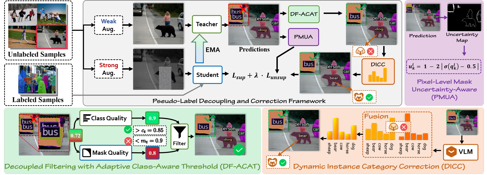
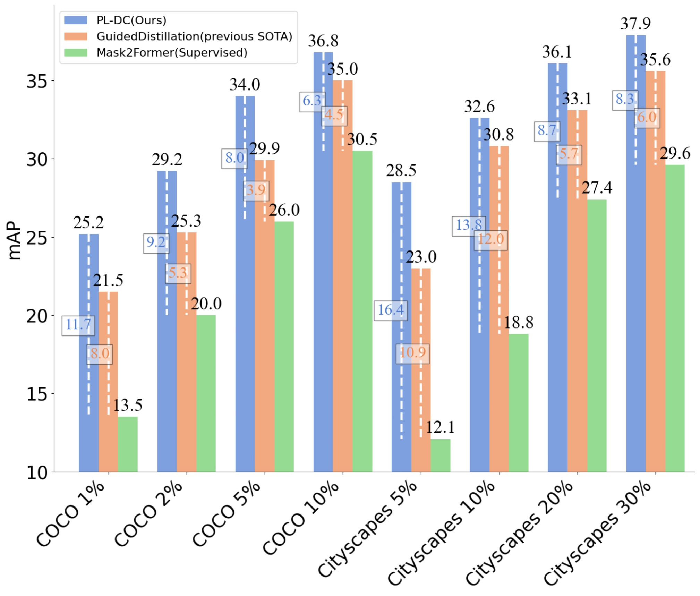

# Robust Pseudo-Labeling via Decoupled Class-Aware Filtering and Dynamic Category Correction
This is an official implementation for AAAI 2026 (**Oral**) paper ["Robust Pseudo-Labeling via Decoupled Class-Aware Filtering and Dynamic Category Correction"](https://ojs.aaai.org/index.php/AAAI/article/view/37630).

## Introduction
The overall of our **PL-DC Framework**. 

<p align="center">
  
</p>

Semi-supervised instance segmentation (SSIS) aims to learn from limited labeled data and large amounts of unlabeled data. Existing methods rely on a single coupled instance score to filter pseudo-labels, which fails to independently evaluate class quality and mask quality, leading to noisy supervision.

We propose **PL-DC** (Pseudo-Label Decoupling and Correction), a new SSIS framework with three novel components:

- **DF-ACAT** — Decoupled Filtering with Adaptive Class-Aware Thresholds: decouples class and mask quality as independent filtering criteria, with per-class thresholds dynamically updated via EMA based on the labeled data distribution.
- **DICC** — Dynamic Instance Category Correction: leverages CLIP with LLM-augmented category descriptions to refine pseudo-label categories, with a cosine-decaying fusion weight that balances CLIP and teacher predictions throughout training.
- **PMUA** — Pixel-Level Mask Uncertainty-Aware: re-weights the mask loss by pixel-level uncertainty, suppressing noisy regions while emphasizing confident pixels.

## Results
<p align="center">
  
</p>

### COCO

| Method | 1% | 2% | 5% | 10% | 100% |
|---|---|---|---|---|---|
| Mask2Former (Supervised) | 13.5 | 20.0 | 26.0 | 30.5 | 43.5 |
| GuidedDistillation | 21.5 | 25.3 | 29.9 | 35.0 | — |
| **PL-DC (Ours)** | **25.2** | **29.2** | **34.0** | **36.8** | **48.8** |
| *vs. baseline* | *+11.7* | *+9.2* | *+8.0* | *+6.3* | *+5.3* |

### Cityscapes

| Method | 5% | 10% | 20% | 30% |
|---|---|---|---|---|
| Mask2Former (Supervised) | 12.1 | 18.8 | 27.4 | 29.6 |
| GuidedDistillation | 23.0 | 30.8 | 33.1 | 35.6 |
| **PL-DC (Ours)** | **28.5** | **32.6** | **36.1** | **37.9** |
| *vs. baseline* | +16.4 | +13.8 | +8.7 | +8.3 |

### Visualization
<p align="center">
  
</p>

## Installation

**Requirements:** Python ≥ 3.8, PyTorch ≥ 1.9, CUDA ≥ 11.1

```bash
# 1. Create environment
conda create -n pl_dc python=3.8 -y
conda activate pl_dc

# 2. Install PyTorch (adjust cuda version as needed)
pip install torch==1.9.0+cu111 torchvision==0.10.0+cu111 -f https://download.pytorch.org/whl/torch_stable.html

# 3. Install detectron2
pip install 'git+https://github.com/facebookresearch/detectron2.git'

# 4. Install detrex
pip install 'git+https://github.com/IDEA-Research/detrex.git'
```

## Data Preparation

```
datasets/
  coco/
    train2017/
    val2017/
    unlabeled2017/
    annotations/
      instances_train2017.json
      instances_val2017.json
  cityscapes/
    leftImg8bit/
    gtFine/
    annotations/
```

For semi-supervised splits, follow the data preparation in [GuidedDistillation](https://github.com/facebookresearch/GuidedDistillation).

## Category Descriptions for DICC

Generate LLM-augmented category descriptions (requires OpenAI API key):

```bash
export OPENAI_API_KEY=sk-...
python tools/generate_category_descriptions.py
```

This produces `pl_dc/modeling/category_descriptions.py` with 5 descriptions per category for COCO and Cityscapes.

## Training

**Semi-supervised training:**

```bash
python tools/train_net_ssl.py \
  --config-file pl_dc/configs/mask2former_r50_coco_instance_seg_1sup_run1_50ep.py \
  --num-gpus 8
```
## Evaluation

```bash
python tools/train_net_ssl.py \
  --config-file pl_dc/configs/mask2former_r50_coco_instance_seg_1sup_run1_50ep.py \
  --eval-only \
  train.init_checkpoint=/path/to/model.pth
```

## Citation

If you find this work useful, please cite:

```bibtex
@inproceedings{lin2026robust,
  title={Robust Pseudo-Labeling via Decoupled Class-Aware Filtering and Dynamic Category Correction},
  author={Lin, Jianghang and Lu, Yilin and Zhu, Chaoyang and Shen, Yunhang and Zhang, Shengchuan and Cao, Liujuan},
  booktitle={Proceedings of the AAAI Conference on Artificial Intelligence},
  volume={40},
  number={9},
  pages={6961--6969},
  year={2026}
}
```

## Acknowledgement

This project builds on [Mask2Former](https://github.com/facebookresearch/Mask2Former), [detrex](https://github.com/IDEA-Research/detrex), [Detectron2](https://github.com/facebookresearch/detectron2), and [GuidedDistillation](https://github.com/facebookresearch/GuidedDistillation). We thank the authors for their excellent work.
